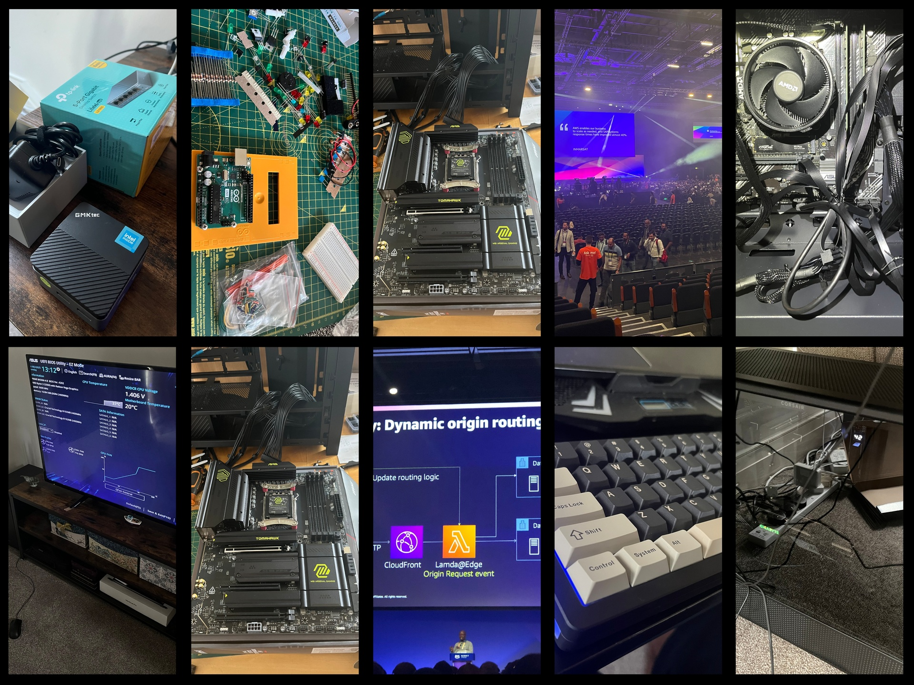

## Nice to meet you, my name is Gabor

Senior Backend Engineer at a telematics insurance company. I lead backend projects end-to-end - scoping work with stakeholders, coordinating with external vendors, and guiding mid-to-junior engineers along the way. I stay hands-on and enjoy solving problems alongside the team.

---

## Expertise / tools

| Category                 | Tools                                      |
| ------------------------ | ------------------------------------------ |
| Languages                | Typescript, Go, Python                     |
| Cloud Platforms          | AWS, Cloudflare, Azure                     |
| IaC & Config Mgmt        | CDK/Cloudformation, Terraform, Ansible     |
| CICD                     | AWS Codepipeline, CircleCI, GitHub Actions |
| Containers/Orchestration | Lambda, Docker, AWS ECS + ECR              |
| Databases/Data platforms | DynamoDB, RDS (PostgreSQL), Databricks     |
| Security & Compliance    | Trivy, Grype, Syft                         |
| Performance              | Hyperfine, Apache Benchmark                |
| Observability            | CloudWatch, X-Ray, Datadog                 |
| Messaging                | SQS, SNS, EventBridge                      |
| Source Control           | Git, GitHub                                |
| Productivity             | Neovim, Mise, AWS Vault, Zellij, Starship  |

---

## Hobbytime tech

### Tooling

Always on the lookout for tools that make engineering more fun. Neovim, starship, k9s, zellij, pass, zoxide, fzf, jq, gron, you name it.

- [Personal dotfiles](https://github.com/GabrielDCelery/personal-dotfiles)
- [Automated local dev environment setup](https://github.com/GabrielDCelery/personal-dev-environment-quickstart)

### Homelab

I build my own PCs and hunt for routers, switches, and components to build the mesh that serves my needs. Currently working on a hybrid cloud + on-prem solution utilizing Kubernetes for managing backups and secure accessibility from anywhere in the world.

- [Homelab](https://github.com/GabrielDCelery/personal-homelab)

### AI

Curious but grounded. The tech is real, we just need to figure out what is the best way to run it cheap and efficient.

- [Shadowrun Lore RAG](https://github.com/GabrielDCelery/shadowrun-lore-rag)
- [YouTube AI Notetaker](https://github.com/GabrielDCelery/youtube-ai-notetaker)

### Network protocols and architecture

I love making things talk to each other over the wire, both physical hardware and network protocols.

- [Netmon - custom network diagnostics TUI](https://github.com/GabrielDCelery/netmon)

